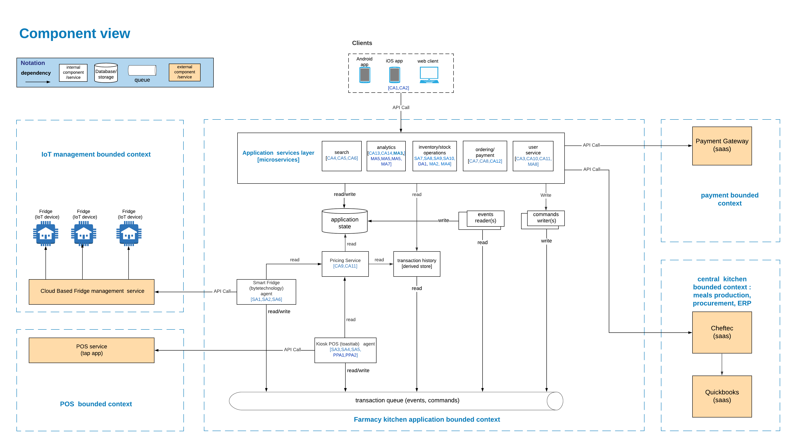

# Component diagram

[Scenarios reference](solution-discovery/all-scenarios.md)

## Highlights
### Application services
Application logic is implemented with microservices each focusing on particular sub domain. This gives us extensibility which is the key requirements for Farmacy Food application. 

### External integrations
Integration with external components is implemented with API calls. Dedicated microservices are responsible for integration with different external bounded contexts.

### Storage
Application state storage component has to support multiple concurrent reads and writes (i.e. be an operational DB).

### Auxiliary services 
We should have dedicated reusable and scalable auxiliary services responsible for technical concerns, e.g. event readers, command writers.
Ephemeral derived stores provide customized information for various microservices, are easy to create and destroy because of transaction log

Based on ADR [8. Integration between bounded contexts](../architecture-decisions/0008-integration-between-bounded-contexts.md)