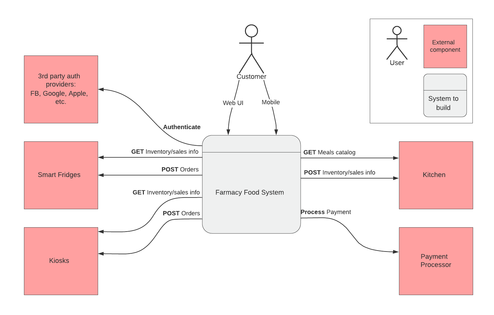
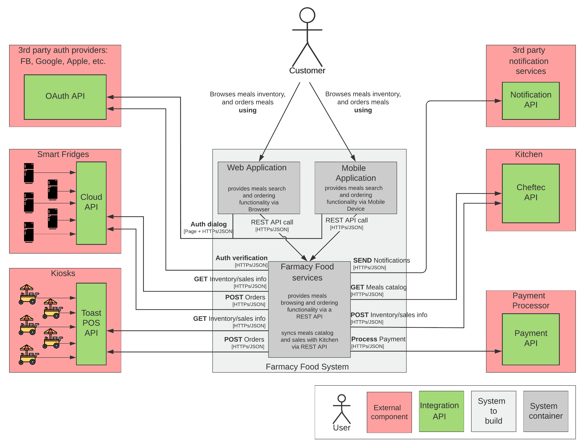

# Farmacy Food Context

## Requirements
> A “ghost kitchen” needs a system to allow users to have visibility of what items are available, purchase, and pick up items at any one of their points of sale.

**Users**: dozens of automated fridges and representative run kiosks, thousands of customers.

**Requirements**:
- Must integrate with 3rd party smart fridges to obtain inventory and purchase activity
- Smart Fridges Produce item inventory levels and purchases. The smart fridges have a cloud based management system that handles communication with the Smart Fridge so obtaining this data would be through an API.
- Must integrate with point of sale system at kiosks
- The Kiosk is a sublet space inside another business where we will sell our product but have an employee handle the transactions through a point of sale. The same data should be accessible through the POS systems API’s.
- Mobile and Web accessible
- Support providing feedback on items of verified purchases and in app surveys
- Accept coupons and promotional pricing
- Send inventory updates to central kitchen

## Context diagram

1. **Mobile/Web** access for Farmacy Food customers
> Requirement: Mobile and Web accessible

2. **3rd party authentication** is one of extra requirements. 
> New system should integrate with 3rd party authentication providers like Google, Facebook, Apple, etc.

3. **Smart Fridges** are accessible via Cloud API. New system should be able to fetch inventory/sales information and post online orders. According to requirements and [Fridge specs](../requirements/Farmacy%20Food%20Smartfridge%20Apt%20Brief.pdf), Cloud API should support all scenarios
> Requirements: 
> - Must integrate with 3rd party smart fridges to obtain inventory and purchase activity
> - Smart Fridges Produce item inventory levels and purchases. The smart fridges have a cloud based management system that handles communication the Smart Fridge so obtaining this data would be through an API.

4. **Kiosks** are accessible via [Toast POS API](https://pos.toasttab.com/). New system should support the same scenarios like in fridges case: fetch inventory/sales info, post online orders. According to requirements and POS documentation, Toast POS API support all scenarios
> Requirements:
> - Must integrate with point of sale system at kiosks
> - The Kiosk is a sublet space inside another business where we will sell our product but have an employee handle the transactions through a point of sale. The same data should be accessible through the POS systems API’s.

5. **Payment gateway**
New system should integrate with an existing Payment gateway
> Quote from session: Company already uses a payment gateway and is happy with it

6. **Kitchen**
New system should send inventory updates to the central kitchen.
**Assumption**: central kitchen is the source of up-to-date meals inventory. New system should be able to pull it using some API
> Requirement: Send inventory updates to central kitchen

## Container diagram
One level zoom in on a container digram shows a bit more details
