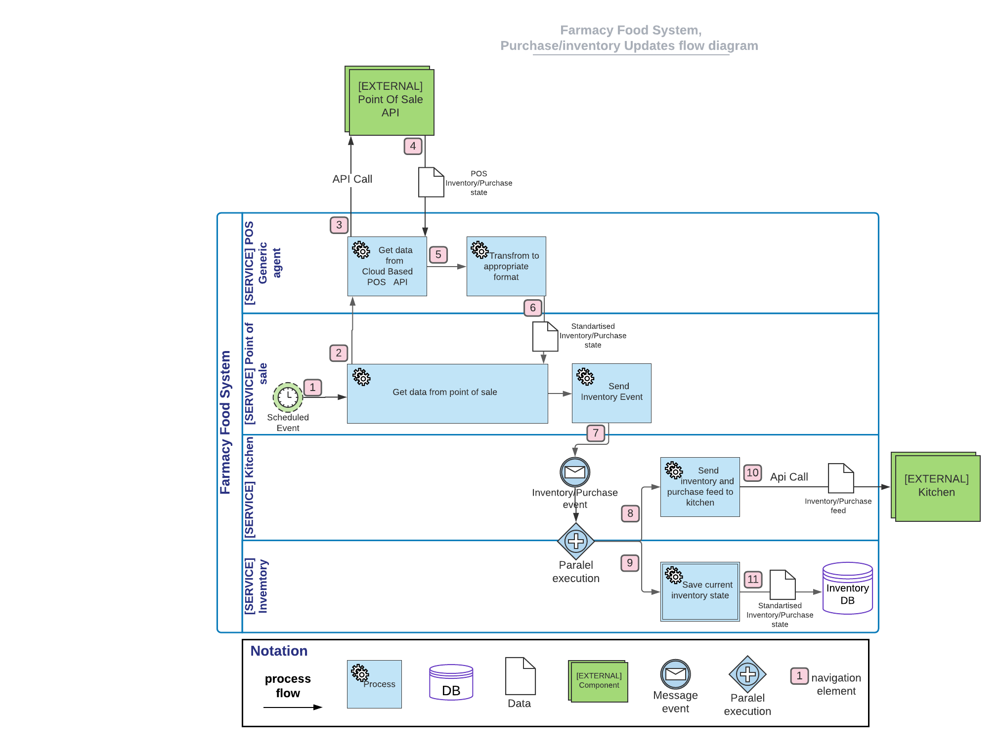
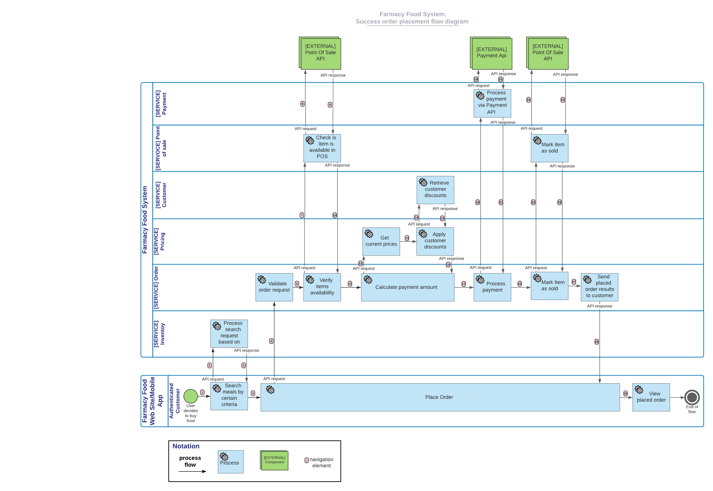

# Sequence diagram

## Inventory/Purchase updates flow

### Quick Summary
Flow starts from retrieving data (inventory state,purchases) from external point of sale api (fridge,kiosk). _**`[navigation elements 1,2,3,4]`**_  
Received data is transformed to standardised format that is known to Farmacy Food System. _**`[navigation element 6]`**_  
Data flow is distributed into two directions _**`[navigation elements 7,8,9]`**_
 - notify a kitchen with inventory and purchase updates _**`[navigation elements 10]`**_
 - save current state to inventory database, for further search usage _**`[navigation element 11]`**_

## Order processing flow

### Quick Summary
Flow starts from user intention to buy food. He opens web site or mobile application and search food based on preference. _**`[navigation elements 1,2,3]`**_  
After view of proposed results user make choice and place order._**`[navigation elements 4-28]`**_  
**Place Order** process is quite complex it requires integration with POS Api (_**`[navigation elements 8,9,24,25]`**_) and Payment Gateway (_**`[navigation elements 19,20]`**_).  
If order placement is success user view results. _**`[navigation element 29]`**_