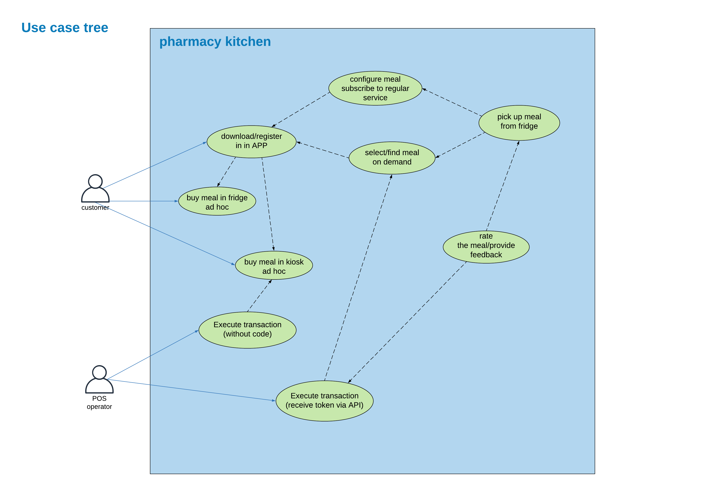

# Use cases
## All identified use cases
[Identified scenarios](solution-discovery/scenarios.md)

## Purchasing scenarios

This portion of use cases shows dependencies between various scenarios related to ordering and purchase of meals:
- Users are allowed to purchase meals having selected them from application as well as ad hoc
- Both scenarios are applicable to Fridges and Kiosks